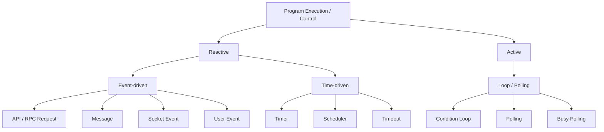

# What Is an AI Agent?

An AI agent is an autonomous system that iteratively makes decisions based on its current state, environment, and goal.

## Program Execution and Agent Loop

Program execution can be broadly understood through two common control styles:

- **Reactive execution**: the program reacts to events, messages, requests, or times.
- **Active execution**: the program actively checks the current state or condition and continues execution.




These execution styles are not mutually exclusive. A program may be triggered by an event or a timer and then continue processing through an internal loop.

When implementing an AI agent, the agent may be started by:
- a user message,
- an API request,
- a scheduled task,
- or another external event.

Therefore, once an AI agent is triggered, its internal task execution is usually driven by an **Agent Loop**.

The Agent Loop repeatedly observes the current state, decides the next action, executes it, evaluates the result, and continues until a termination condition is reached.

```mermaid
flowchart TD
    A[Goal] --> B[Observe current state]
    B --> C[Decide what to do]
    C --> D[Take action]
    D --> E[Observe result]
    E --> F{Task completed?}
    F -- No --> C
    F -- Yes --> G[Task completed]
