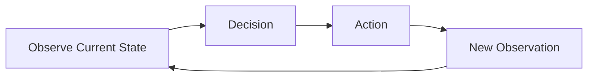
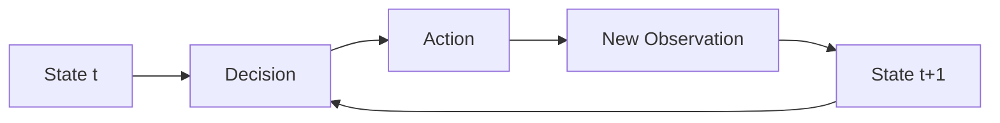
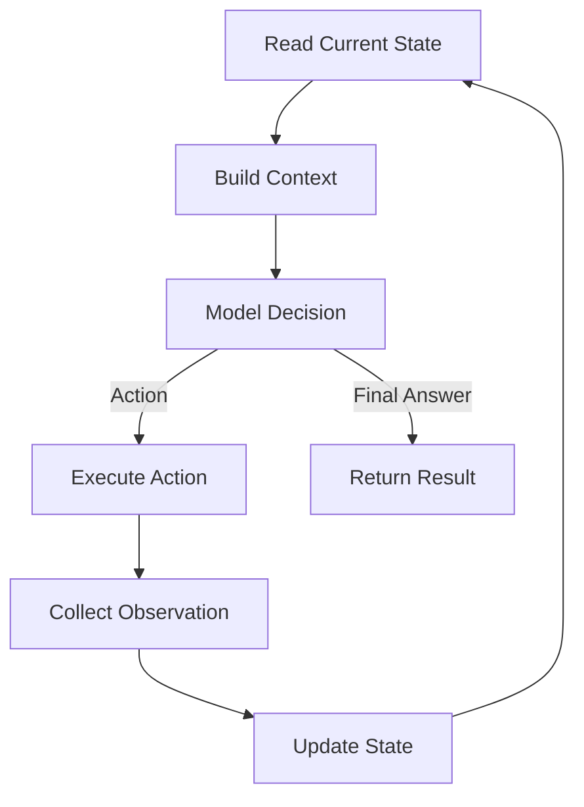

# Agent Loop

## Agender
```text
Agent Loop
│
├── 1. Definition
├── 2. Why an Agent Needs a Loop
├── 3. Basic Loop Structure
├── 4. State Transition
├── 5. What Happens in One Iteration
├── 6. Termination Conditions
├── 7. Error / Retry / Human Intervention
└── 8. Minimal Pseudocode
```


### Definition

An Agent Loop is the control mechanism that repeatedly observes the agent's current state, decides what to do next, executes an action, and evaluates the result until it reaches a termination condition. 

### Why an Agent Needs a Loop

A single step(an LLM call) is usually not enough to complete a real-world task. Many tasks require multiple steps.
For Example: Find the largest Python file in a repository and explain what it does.

The agent may need to :
- inspect the repository,
- list Python files,
- compare file sizes,
- select the largest file,
- read the file,
- analyse the code,
- generate a summary of the code as the final answer.

The complete execution path may not be known in advance. After each action, the agent receives new information. That new information may change what the agent should do next.

For example:
```text
Initial state
    ↓
Agent decides to inspect files
    ↓
New observation: repository contains 200 Python files
    ↓
Agent decides to filter by size
    ↓
New observation: which file has the largest size
    ↓
Agent decides to read that file
    ↓
New observation: file imports another module
    ↓
Agent may decide to inspect that module
```

Therefore, an agent needs a loop because the task evolves as new observations become available.

### Basic Loop Structure

At a high level, we can summarise it as follows:



Without a loop, the model would have to predict the entire execution path before seeing the result of previous actions. That would make the system much less adaptive.

#### Key Idea:
The Agent loop allows the agent to continuously adapt its actions based on the new observed state.

### State Transition

As mentioned in the previous subsection, an AI agent updates its state after performing an action and observing the result in each iteration.

From a state-transition perspective, the Agent Loop can be represented as follows:



### What Happens in One Iteration?

A single iteration normally ends after the state has been updated. The updated state becomes the input to the next iteration.



