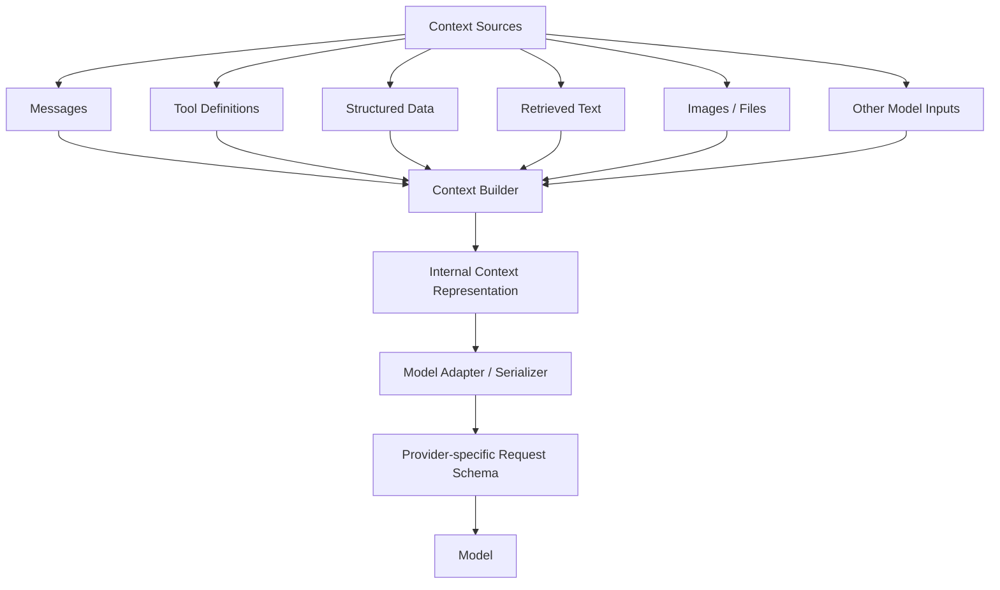
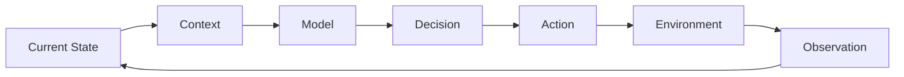
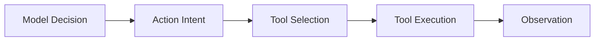

# 03 Core Components

## Agender

```text
AI Agent
├── Model
├── Context
├── State
├── Actions
├── Action Runtime
└── Agent Runtime
```

Core Components Table
| Component | Core Question | Responsibility |
|---|---|---|
| **Model** | Who thinks? | Reasoning and decision-making |
| **Context** | What does it currently know? | Information given to the model |
| **State** | What does it remember? | Persistent task information |
| **Actions** | What can it do? | Interact with the environment |
| **Action Runtime** | How is an AgentAction safely turned into a real operation? | Coordinate iterative execution |
| **Runtime / Harness** | Who manages everything? | Orchestrate the whole Agent |


## Model

The Model of an AI Agent is the reasoning and decision-making component of an AI Agent system. It's usually implemented as a large language model, such as GPT, Claude, DeepSeek, Gemini, or Llama.

```text
          Model
            │
            ▼
Observe → Decide → Action
```

**Key Idea**:
The runtime controls the loop, while the model makes decisions inside the loop.

## Context

The model does not directly observe the environment. It reasons over the context provided by the agent runtime.

### Definition:
Context is the set of information made available to the model for a specific inference or decision.

```text
Agent State / Memory / Environment
              ↓
        Context Builder
              ↓
           Context
              ↓
            Model
              ↓
          Decision
```

Context may contain:
```text
Context
│
├── System Instructions
│
├── User Request / Goal
│
├── Conversation History
│
├── Current Task State
│
├── Previous Actions
│
├── Tool Observations / Results
│
├── Retrieved Knowledge
│
├── Skill Instructions
│
├── Available Tool Descriptions
│
└── Environment Information
```

For example: Find the largest Python file and explain it.
```text
System:
You are a coding assistant.

User Goal:
Find the largest Python file and explain what it does.

Current State:
Repository inspection is in progress.

Previous Observation:
There are 200 Python files.

Previous Action:
Calculated file sizes.

New Observation:
agent.py is the largest file.

Available Actions:
- read_file
- list_files
- search_code

Current Question:
What should I do next?
```

The most common context format is structured data, like JSON.

```json
{
  "messages": [
    {
      "role": "system",
      "content": "You are a coding agent."
    },
    {
      "role": "user",
      "content": "Find the largest Python file."
    },
    {
      "role": "assistant",
      "content": "I will inspect the repository."
    },
    {
      "role": "tool",
      "content": "agent.py: 120 KB"
    }
  ],
  "tools": [
    {
      "name": "read_file",
      "description": "Read a file from the repository"
    }
  ]
}
```

**Note**: The APIs of different models actually use different schemas. 

Therefore, the context can be serialised into 



#### Key Idea:

Context is model-visible information, not necessarily plain text.

In terms of Implementation, Agent context is an internal structure. Therefore, a provider-independent internal representation of the information that should be visible to the model for the current decision.

The Context Builder integrates relevant context from multiple sources into a unified internal representation.

For example:
```text
State / Memory / Tool Results / Retrieved Data
                    ↓
             Context Builder
                    ↓
              AgentContext
          [internal structure]
                    ↓
              Model Adapter
          ┌─────────┼─────────┐
          ↓         ↓         ↓
       OpenAI    Claude    DeepSeek
        schema     schema      schema
```


## State

**Definition**:
State is the information an agent maintains across iterations that represents the task's current status and lets it continue working coherently.

The clean distinction is:
State is what the agent maintains. Context is what the model sees.

So the Context Builder typically reads from the current state:

```text
Current State
│
├── task goal
├── current plan
├── completed steps
├── previous actions
├── tool results
├── iteration count
├── errors
└── other runtime data
        ↓
   Context Builder
        ↓
Select relevant parts
        ↓
      Context
        ↓
       Model
```

For example, suppose the state is:

```python
state = {
    "goal": "Find the largest Python file",
    "iteration": 4,
    "completed_steps": [
        "listed files",
        "filtered Python files",
        "compared file sizes"
    ],
    "last_observation": "agent.py is the largest file",
    "token_usage": 18234,
    "start_time": "...",
    "retry_count": 0
}
```

The model probably needs:

```text
goal
completed_steps
last_observation
```

So the Context Builder might produce:
```python
AgentContext(
    goal=state["goal"],
    task_progress=state["completed_steps"],
    observations=[state["last_observation"]],
)
```

In conclusion, the Context Builder derives the mode-visitable context from the current agent state and other relevant information sources.

```text
Context = selected view of State + Memory + Tool Results + Retrieved Knowledge + Instructions
```


## Actions

An action is an operation selected by the agent to interact with or change its environment.

Examples include:
- reading a file
- searching the web
- executing a command
- querying a database
- calling an API
- sending a message
- delegating work to another agent

The model typically selects or requests an action, while the Agent Runtime validates and executes it.



**Action Type**:
- Read / Observe Actions
- Write / Modify Actions
- Execution Actions
- Communication Actions
- Delegation Actions

However, there is a gap between an LLM output and an action. AI Agents usually cannot convert natural language text into AgentAction through re-expression. 
The best way is to let the Model output a structured tool/action request. Then, using the Model Adapter, transfer provider-specific output to a uniform AgentAction.

For example:
```text
Context
   ↓
Model
   ↓
Provider-specific structured output
   ↓
Model Adapter
   ↓
AgentAction
   ↓
Validation
   ↓
Action Runtime (Execute the action)
```

The structured-output instructions:

```json
{
  "action_type": "tool_call",
  "name": "read_file",
  "arguments": {
    "path": "agent.py"
  }
}
```

Transfer to AgentAction by Adapter:

```python
AgentAction(
    action_type="tool_call",
    name="read_file",
    arguments={"path": "agent.py"}
)
```


How to represent an action in Agent Runtime?

An action can be represented as a uniform data structure.

```python
@dataclass
class AgentAction:
    type: str
    name: str
    arguments: dict
```

**One more things:**

What is the difference between an Action and a Tool in an AI agent?

Action = a conceptual operation. For example:
```text
Action intent:
Read a file
```

Tool = a concrete executable interface
```text
Tool:
read_file(path="agent.py")
```



## Action Runtime

The Action Runtime is the execution subsystem responsible for validating, authorising, dispatching, and observing AgentActions.

```text
AgentAction
    ↓
Action Runtime
    ↓
Validation
    ↓
Authorization / Policy
    ↓
Action Dispatcher
    ↓
Capability Provider
    ├── Native
    ├── MCP
    ├── API
    └── Subagent
    ↓
Observation
```

## Agent Runtime

