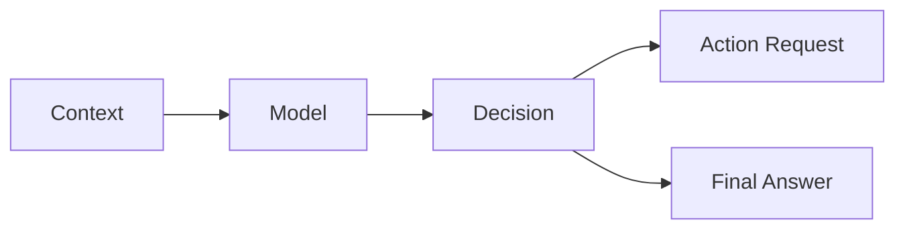
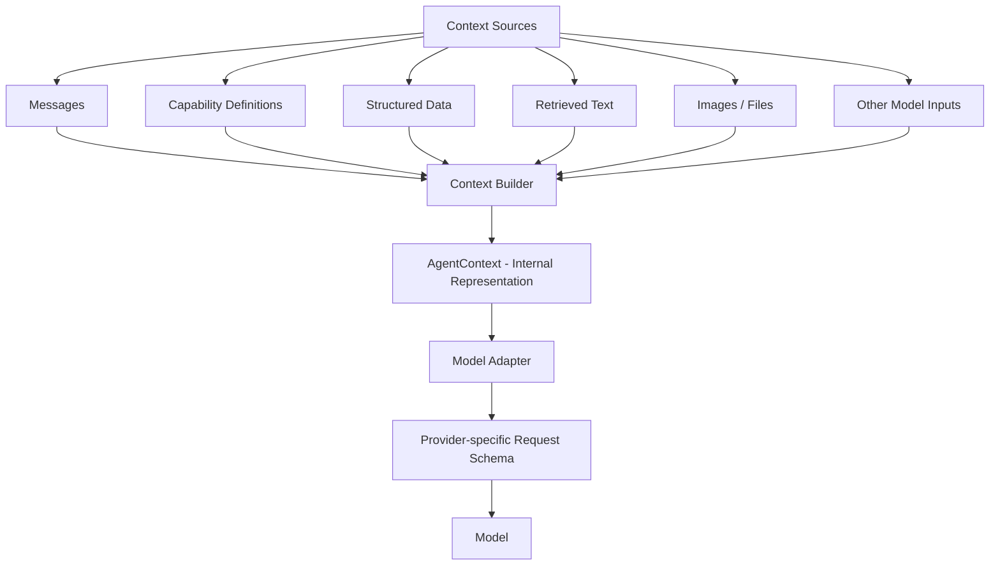
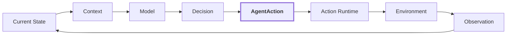
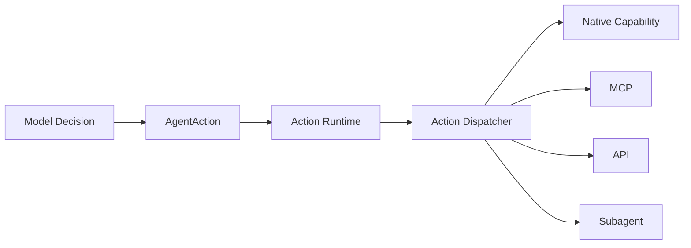
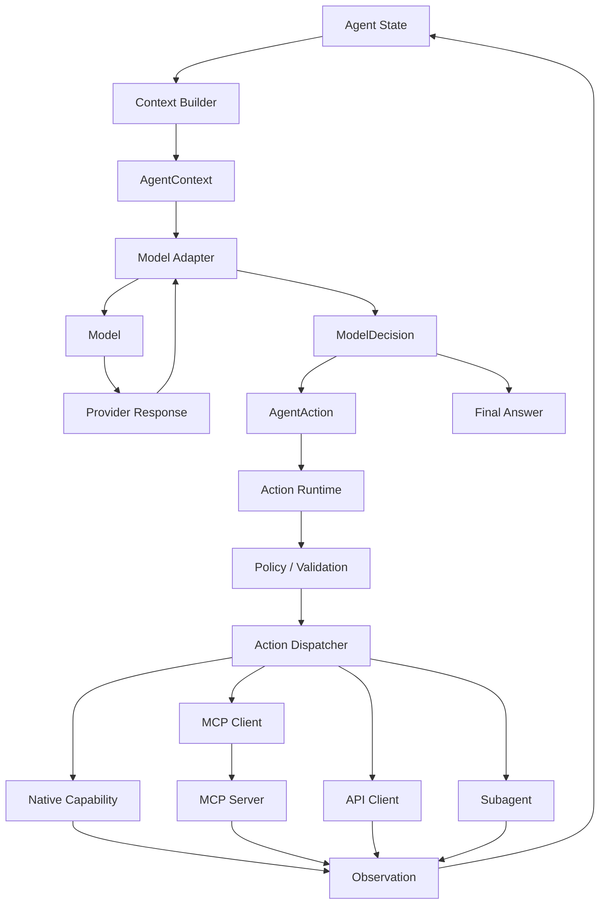

# 03 Core Components

## Agenda

```text
AI Agent System
├── Model
├── Context
├── State
├── Actions
├── Action Runtime
└── Agent Runtime
```

## Core Components Table

| Component | Core Question | Responsibility |
|---|---|---|
| **Model** | Who thinks? | Reasoning and decision-making |
| **Context** | What does the model currently know? | Information made visible to the model for the current decision |
| **State** | What does the agent maintain? | Persistent task and execution information across iterations |
| **Actions** | What can the agent request to do? | Interact with or change the environment |
| **Action Runtime** | How is an `AgentAction` safely carried out? | Validate, authorise, dispatch, and observe actions |
| **Agent Runtime** | Who coordinates the whole system? | Run and coordinate the agent system |

---

## Model

The Model is the reasoning and decision-making component of an AI Agent system. It is usually implemented by a large language model such as GPT, Claude, DeepSeek, Gemini, or Llama.



**Key Idea:**

The Agent Runtime controls the loop, while the Model makes decisions inside the loop.

---

## Context

The Model does not directly observe the environment. It reasons over the context provided by the Agent Runtime.

### Definition

Context is the set of information made available to the Model for a specific inference or decision.

```text
Agent State / Memory / Environment
              ↓
        Context Builder
              ↓
           Context
              ↓
            Model
              ↓
          Decision
```

Context may contain:

```text
Context
│
├── System Instructions
├── User Request / Goal
├── Conversation History
├── Current Task State
├── Previous Actions
├── Tool Observations / Results
├── Retrieved Knowledge
├── Skill Instructions
├── Available Capability Descriptions
└── Environment Information
```

For example, suppose the task is:

> Find the largest Python file and explain what it does.

The model-visible context might contain:

```text
System:
You are a coding assistant.

User Goal:
Find the largest Python file and explain what it does.

Current State:
Repository inspection is in progress.

Previous Observation:
There are 200 Python files.

Previous Action:
Calculated file sizes.

New Observation:
agent.py is the largest file.

Available Actions:
- read_file
- list_files
- search_code

Current Question:
What should I do next?
```

In an Agent Runtime, context is usually represented internally as a structured data model. When calling a model provider, the Model Adapter serialises this internal representation into the provider-specific request format.

A simplified provider request may look like:

```json
{
  "messages": [
    {
      "role": "system",
      "content": "You are a coding agent."
    },
    {
      "role": "user",
      "content": "Find the largest Python file."
    },
    {
      "role": "assistant",
      "content": "I will inspect the repository."
    },
    {
      "role": "tool",
      "content": "agent.py: 120 KB"
    }
  ],
  "tools": [
    {
      "name": "read_file",
      "description": "Read a file from the repository"
    }
  ]
}
```

**Note:** Different model providers use different request schemas.

Different context sources can be collected and normalised into an internal context representation:



### Key Ideas

Context is model-visible information, not necessarily plain text.

`AgentContext` is a provider-independent internal representation of the information that should be visible to the Model for the current decision.

The Context Builder collects, selects, filters, and organises relevant information from multiple sources into this unified internal representation.

```text
State / Memory / Tool Results / Retrieved Data
                    ↓
             Context Builder
                    ↓
              AgentContext
          [internal structure]
                    ↓
              Model Adapter
          ┌─────────┼─────────┐
          ↓         ↓         ↓
       OpenAI    Claude    DeepSeek
        schema     schema      schema
```

---

## State

### Definition

State is the information an agent maintains across iterations that represents the task's current status and allows it to continue working coherently.

A useful distinction is:

> **State is what the agent maintains. Context is what the model sees.**

State is the source of truth for the current execution, while Context is a selected model-facing view of that state and other relevant information.

The Context Builder typically reads from the current State:

```text
Current State
│
├── task goal
├── current plan
├── completed steps
├── previous actions
├── tool results
├── iteration count
├── errors
└── other runtime data
        ↓
   Context Builder
        ↓
Select relevant parts
        ↓
      Context
        ↓
       Model
```

For example:

```python
state = {
    "goal": "Find the largest Python file",
    "iteration": 4,
    "completed_steps": [
        "listed files",
        "filtered Python files",
        "compared file sizes"
    ],
    "last_observation": "agent.py is the largest file",
    "token_usage": 18234,
    "start_time": "...",
    "retry_count": 0
}
```

The Model probably needs:

```text
goal
completed_steps
last_observation
```

So the Context Builder might produce:

```python
AgentContext(
    goal=state["goal"],
    task_progress=state["completed_steps"],
    observations=[state["last_observation"]],
)
```

In conclusion, the Context Builder derives the model-visible context from the current Agent State and other relevant information sources.

```text
Context = selected view of State + Memory + Tool Results + Retrieved Knowledge + Instructions
```

---

## Actions

An Action is an operation selected by the agent to interact with or change its environment.

Examples include:

- reading a file
- searching the web
- executing a command
- querying a database
- calling an API
- sending a message
- delegating work to another agent

The Model produces an action request, which is normalised into an `AgentAction`. The Action Runtime then validates, authorises, and dispatches the action to an appropriate capability provider.



### Action Types

- Read / Observe Actions
- Write / Modify Actions
- Execution Actions
- Communication Actions
- Delegation Actions

### From Model Output to AgentAction

There is a gap between Model output and an executable action.

Although an Agent Runtime can parse natural-language Model output into actions, this approach is fragile. Modern agent systems usually prefer structured output or native tool-calling mechanisms so that Model decisions can be reliably normalised into `AgentAction`.

```text
Structured Model Output
   ↓
Model Adapter
   ↓
AgentAction
   ↓
Action Runtime
```

A simplified internal action representation could look like:

```json
{
  "action_type": "tool_call",
  "name": "read_file",
  "arguments": {
    "path": "agent.py"
  }
}
```

The Model Adapter can normalise a provider-specific response into the internal representation:

```python
AgentAction(
    action_type="tool_call",
    name="read_file",
    arguments={"path": "agent.py"}
)
```

An action can be represented as a uniform internal data structure:

```python
from dataclasses import dataclass
from typing import Any

@dataclass
class AgentAction:
    action_type: str
    name: str
    arguments: dict[str, Any]
```

### Action vs Tool

An Action is the higher-level operation selected by the Agent.

For example:

```text
Action intent:
Read a file
```

A Tool is one possible mechanism for carrying out an Action.

For example:

```text
Tool:
read_file(path="agent.py")
```

However, not every Action must be implemented as a local Tool. The execution mechanism may instead be MCP, an external API, a subagent, or another capability provider.



---

## Action Runtime

The Action Runtime is the execution subsystem responsible for validating, authorising, dispatching, and observing `AgentAction`s.

```text
AgentAction
    ↓
Action Runtime
    ↓
Validation
    ↓
Authorization / Policy
    ↓
Action Dispatcher
    ↓
Capability Provider
    ├── Native Capability
    ├── MCP
    ├── API
    └── Subagent
    ↓
Observation
```

A more complete view is:



The Action Runtime hides the details of how a capability is actually implemented. The Agent can therefore work with a common `AgentAction` abstraction while the Action Dispatcher routes that action to the appropriate provider.

---

## Agent Runtime

The Agent Runtime is the software execution layer that coordinates the components required to run an AI Agent.

It does not replace the Agent Loop. Instead, it provides the infrastructure needed for the loop to operate.

```text
Agent Runtime
│
├── Agent Loop
├── Context Builder
├── State Management
├── Model Adapter / Router
├── Action Runtime
└── Termination / Error Handling
```

The Agent Loop defines the iterative control logic, while the Agent Runtime provides the concrete services used by that loop.

For example:

```python
while can_continue(state):
    context = context_builder.build(state)
    decision = model_runtime.generate(context)

    if decision.final_answer:
        return decision.final_answer

    observation = action_runtime.execute(decision.action)
    state_manager.update(state, observation)
```

### Key Idea

> **The Agent Runtime is the execution layer that connects Model, Context, State, and Actions and provides the infrastructure required to run the Agent Loop.**

A production-grade Agent Runtime may later add more capabilities such as sessions, scheduling, sandboxing, tracing, replay, and plugin systems. These topics belong to the later Agent Harness section.
