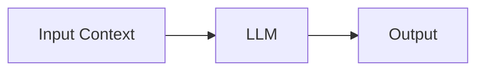
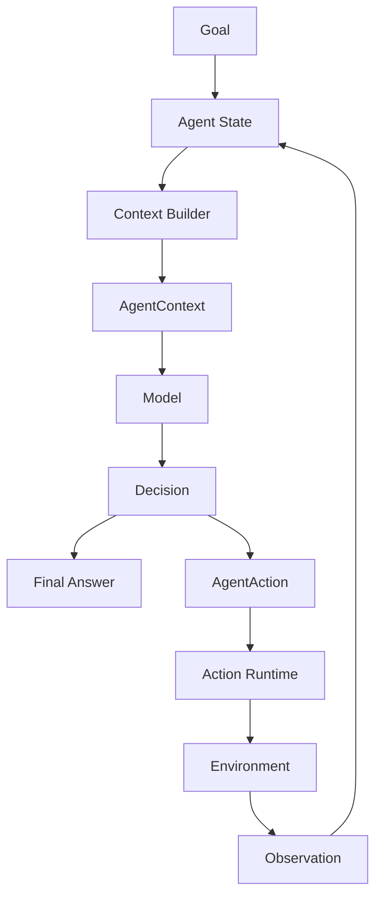
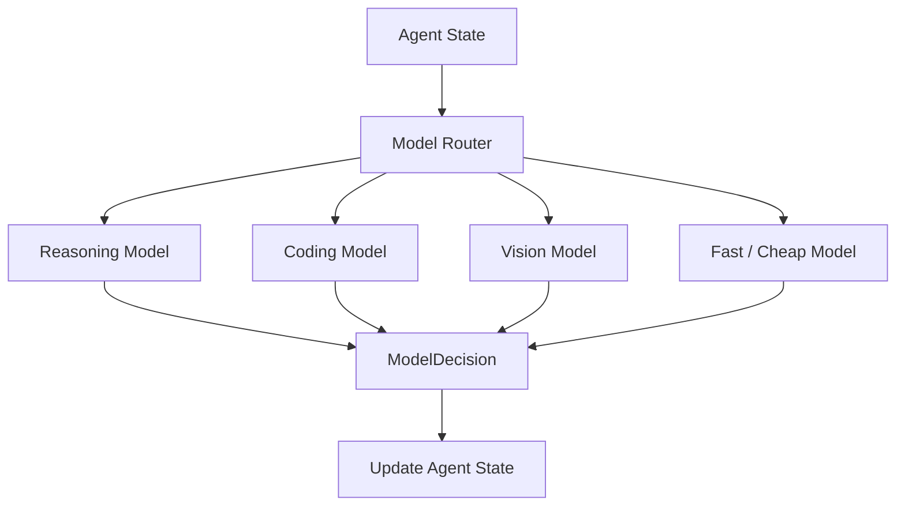

# 04 - LLM vs Agent

## Definition

A Large Language Model (LLM) is a model that processes input context and generates an output such as text, structured data, or an action request.

An AI Agent is a software system that uses one or more LLMs inside an execution loop to maintain state, make decisions, perform actions, observe results, and work toward a goal.

A useful distinction is:

> **An LLM provides intelligence. An Agent provides goal-directed execution.**

---

## LLM

At a high level, an LLM behaves like:



The output may be:
- natural language
- structured output
- an action request
- code
- multimodal output
However, the model itself does not normally maintain the whole task lifecycle.

Once the invocation finishes, the model does not automatically:
- persist task state
- execute actions
- observe the result
- decide whether another iteration is required
- enforce permissions
- manage retries or termination conditions
Those responsibilities belong to the surrounding Agent system.

## Agent

An Agent adds an execution architecture around the model.


The Agent Runtime is responsible for coordinating this process.
Therefore:
```text
LLM = Reasoning/generation capability
```
While:
```text
Agent System = Goal + Model(s) + Agent Runtime + Capabilities + Environment Interface
```


### Why Is an LLM Not an Agent?

The key difference is not simply tool calling.

An LLM can generate a tool-call request, but that does not mean the model itself is executing an autonomous task.

For example:
```text
LLM:
"Call read_file('agent.py')"
```

The Agent system must still:
```text
Parse / normalise the decision
        ↓
Create AgentAction
        ↓
Validate and authorise it
        ↓
Dispatch the action
        ↓
Receive an observation
        ↓
Update state
        ↓
Build the next context
        ↓
Invoke a model again
```

Therefore, tool-calling capability makes an LLM more useful inside an Agent, but tool calling alone does not create the Agent Runtime.

**LLM vs Agent**

| Aspect | LLM | Agent |
|---|---|---|
| Primary role | Reasoning / generation | Goal-directed task execution |
| Input | Context | Goal + State + Context |
| Output | Text / structured output / action request | Actions, observations, state transitions, final result |
| State management | Usually external | Maintained by the Agent Runtime |
| Iteration | One inference call | Repeated Agent Loop |
| Environment interaction | Requests an action | Coordinates actual interaction |
| Termination | Model response ends | Explicit termination conditions |
| Model choice | One invocation uses a model | Different iterations may use different models |


### One Agent Can Use Multiple Models

An Agent is not necessarily bound to one LLM.

Because the Agent owns the task and state, different iterations can use different models.
  


## Key Takeaways
1. An LLM is a reasoning and generation component.
2. An Agent is a software system that uses models to pursue a goal over multiple iterations.
3. State, actions, execution, and termination are managed outside the LLM.
4. The model requests an action; the Agent Runtime executes it.
5. One Agent can dynamically use multiple models across different iterations or subtasks.
