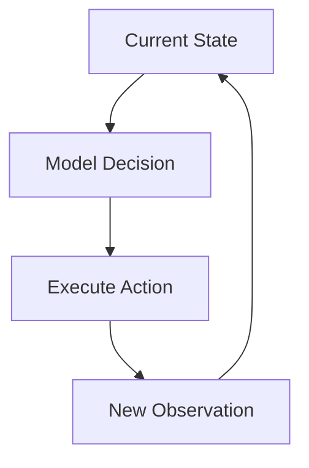
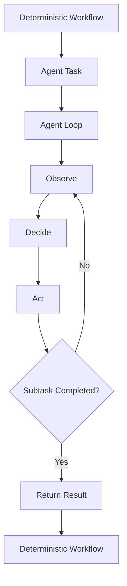

# 05 - Agent vs Workflow

## Workflow

### Definition

A workflow is a predefined sequence or graph of steps for completing a task.

A workflow can include branches, loops, retries, error handling, and termination conditions. Its key characteristic is that the control structure and transition rules are primarily defined by the developer before runtime.

For example:

```text
Receive Request
      ↓
Parse Input
      ↓
Call API
      ↓
Save Result
      ↓
Send Notification
```

**Key Idea**

The execution path may be dynamic at runtime, but the possible transitions and the rules that select them are primarily predefined by the developer.

For example:

```python
if dns_failed:
    diagnose_dns()
elif tcp_failed:
    diagnose_network()
elif app_failed:
    diagnose_application()
else:
    finish()
```

A workflow can therefore be viewed as using a developer-defined transition policy:

```text
Current State
     ↓
Developer-defined transition rule
     ↓
Next Step
```

## Agent

### Definition

An Agent is a goal-directed system that can dynamically determine what to do next based on its current state, context, and observations.



The developer still defines important boundaries such as:

- the goal or task
- available capabilities
- policies and permissions
- runtime constraints
- termination conditions

However, the next action does not need to be fully encoded as a predefined transition rule.

```text
Developer
   ↓
defines goal, boundaries, capabilities, and policies
   ↓
Agent Runtime + Model
   ↓
dynamically select the next action at runtime
```

For example:

```python
while not finished:
    context = build_context(state)
    decision = model(context)

    action = parse(decision)
    observation = action_runtime.dispatch(action)

    state.update(observation)
```

## The Key Difference: Who Determines the Next Transition?

Both workflows and agents can have:

- state
- branches
- loops
- retries
- error handling
- termination conditions

The key distinction is not whether the system has loops or conditions, but **who determines the next transition**.

```text
Workflow
Current State
    ↓
Developer-defined control policy
    ↓
Next Step
```

```text
Agent
Current State
    ↓
Context Builder
    ↓
Model-driven decision
    ↓
Next Action
```

At a high level:

```text
Workflow:
Action = f_developer(State)

Agent:
Action = f_model(Context(State))
```

## An LLM Does Not Automatically Make a Workflow an Agent

A workflow can use one or more LLM calls while still remaining primarily a workflow.

For example:

```text
Input
  ↓
LLM Classify
  ↓
LLM Summarize
  ↓
Store Result
  ↓
Send Notification
```

If the control flow and transition rules are predefined by the developer, this is still primarily an **LLM-powered workflow**.

## Workflow and Agent Can Be Combined

Workflows and agents are not mutually exclusive.

Production systems often use deterministic workflows for well-known processes and agents for parts that require dynamic reasoning or runtime decision-making.



A practical engineering principle is:

> **Use deterministic workflows when the execution policy is known and stable. Use agents when the next action depends on information discovered at runtime.**

## Summary

| Aspect | Workflow | Agent |
|---|---|---|
| Control policy | Primarily developer-defined | Model-driven at runtime |
| State | Yes | Yes |
| Branches / loops | Yes | Yes |
| Retry / termination | Yes | Yes |
| Next step | Selected by predefined transition rules | Dynamically selected from current context and observations |
| Predictability | Usually higher | Usually lower |
| Flexibility | Usually lower | Usually higher |
| Best suited for | Known and stable processes | Open-ended or uncertain tasks |

**Key Takeaway**

> A workflow primarily follows developer-defined transition rules, while an agent can dynamically determine the next action at runtime based on its current state, context, and observations.
