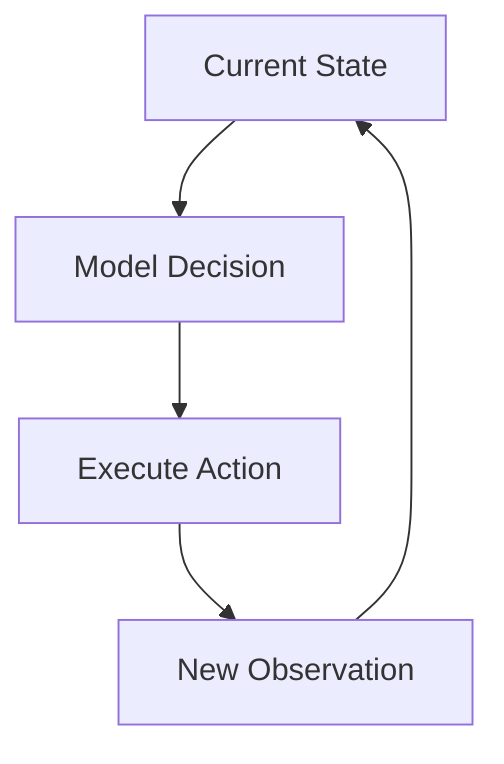

# 05 - Workflow vs Agent

## Workflow
### Definition
A workflow is a predefined sequence or graph of steps for completing a task.

For example:
```text
Receive Request
      ↓
Parse Input
      ↓
Call API
      ↓
Save Result
      ↓
Send Notification
```

**Key Idea**
The execution path is mainly defined by the developer.

## Agent

### Definition
An Agent is a goal-directed system that dynamically decides what to do next based on its current state and observations.

For example:


The key difference: Who controls the execution path?

In terms of workflow, the developer defines the control flow before the program runs.
```text
Developer
   ↓
defines control flow
   ↓
Program executes
```

For example:
```python
step1()
step2()

if condition:
    step3()
else:
    step4()
```

In terms of an AI Agent, the developer defines boundries/capabilities before the agent runs
```text
Developer
   ↓
defines boundaries/capabilities

Model + Runtime
   ↓
decides the next step at runtime
```
For example:
```python
while not finished:
    context = build_context(state)
    decision = model(context)

    action = parse(decision)
    observation = execute(action)

    state.update(observation)
```

**Key Idea**:

A workflow can contain branches, loops, retries, and termination conditions, but its control structure and transition rules are primarily predefined by the developer. An agent can dynamically determine the next action at runtime based on its current state and observations.
