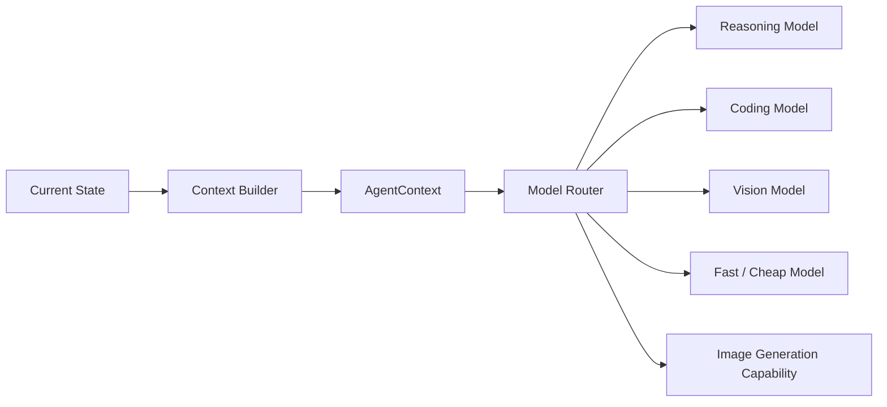

# Dynamic Multi-Model Routing

## Goal

Allow one Agent Task to use different models across iterations or subtasks without changing the core Agent Loop.

## Motivation

Different models have different strengths, latency, cost, context limits, modalities, and privacy properties. A single task does not need to be bound to one model.

## Core Idea

Use provider-independent internal representations such as `AgentContext`, `AgentState`, `AgentAction`, and `ModelDecision`. A `ModelRouter` selects the most suitable model for the current state and subtask, while a `ModelAdapter` converts the common internal representation into a provider-specific request.

## Possible Routing Signals

- current subtask
- required capability
- task complexity
- risk level
- latency requirement
- cost budget
- privacy requirement
- context size

## Key Principle

> The Agent owns the task and state; the model is a replaceable reasoning capability selected for the current step.

## Next Experiment

Implement a simple rule-based `ModelRouter` in MiniClaw and route summarization, coding, and image-related subtasks to different adapters.
