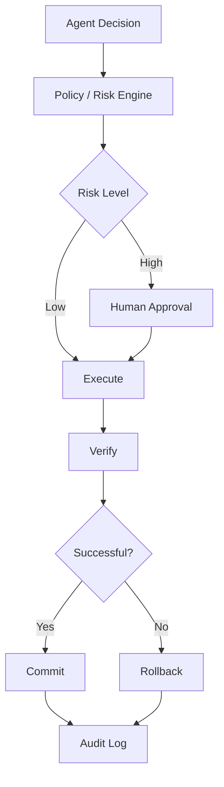

# Secure Agent Harness

## Goal

Build a secure and auditable Agent Harness for agents that interact with real systems.

## Motivation

General-purpose agents can call tools and act autonomously, but production use requires stronger guarantees around permissions, containment, approvals, verification, and auditability.

## Core Idea

Place a security and policy layer between model decisions and real-world execution.

## Planned Capabilities

- capability-based permissions
- least privilege
- risk classification
- human approval
- sandboxed execution
- dry run
- post-action verification
- rollback
- event tracing
- session replay

## Long-Term Question

What engineering mechanisms are required before we can trust an autonomous agent to operate on production systems?

## Next Experiment

Start with a permission layer that differentiates read-only actions from state-changing actions.
