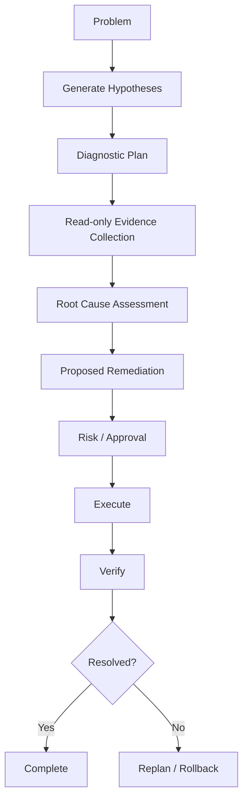

# Secure Systems Agent

## Goal

Build a domain-specialized agent for Linux, networking, containers, cloud, and security operations.

## Motivation

A domain agent can combine strong systems knowledge with controlled tool execution instead of behaving like a generic chatbot with shell access.

## Core Idea

The agent should diagnose first, gather evidence with low-risk read-only actions, propose remediation, request approval for risky changes, execute safely, and verify the result.

## Possible Domains

- Linux troubleshooting
- TCP/IP and network diagnosis
- Docker and Kubernetes
- cloud infrastructure
- security operations
- performance troubleshooting

## North-Star Goal

> Build an AI agent that I would actually trust with root access to a production Linux server.

## Next Experiment

Create a read-only Linux diagnostic skill that can inspect CPU, memory, processes, disks, networking, and logs without modifying the system.
