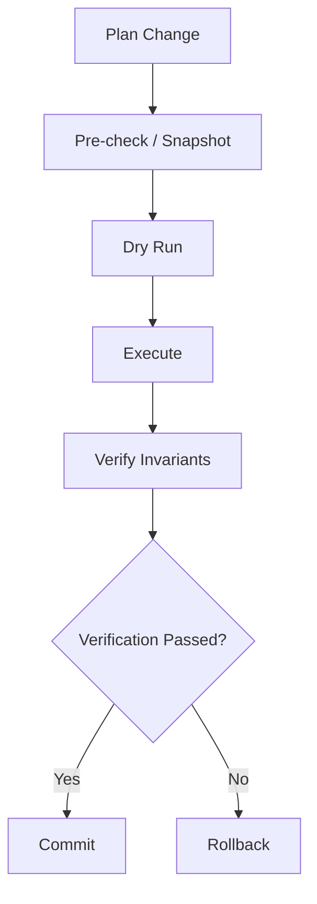

# Transactional Agent Execution

## Goal

Treat risky agent actions more like transactions: prepare, execute, verify, commit, or roll back.

## Motivation

An agent should not assume that an action succeeded just because a tool returned without error. Real systems need post-action verification and recovery when changes produce the wrong state.

## Core Idea

## Possible Applications

- configuration changes
- Kubernetes updates
- firewall or routing changes
- file modifications
- infrastructure automation

## Key Principle

> Completion should be based on verified state, not only on the model's claim that the task is finished.

## Open Questions

- How should rollback metadata be generated?
- Which actions are naturally reversible?
- How should irreversible actions be handled?
- How can verification conditions be expressed safely?

## Next Experiment

Implement a reversible file-edit action with snapshot, write, verification, and rollback.
