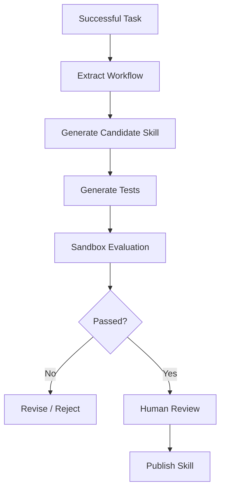

# Self-Learning Skills

## Goal

Allow an agent to turn successful task trajectories into reusable candidate skills.

## Motivation

Agents repeatedly solve similar problems. Instead of starting from scratch every time, successful workflows could be distilled into reusable instructions and tested before publication.

## Core Idea



## Safety Principle

A learned skill should never become trusted automatically.

The pipeline should be:

```text
learn -> test -> review -> publish
```

not:

```text
learn -> immediately reuse forever
```

## Open Questions

- How do we generalize from one successful trajectory?
- How do we avoid learning accidental or unsafe behavior?
- How should skill versions and tests be maintained?
- How do we decide when two skills are duplicates?

## Next Experiment

Record a successful MiniClaw workflow and manually convert it into a `SKILL.md`, then define tests that verify the workflow still behaves correctly.
