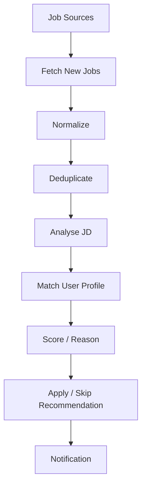

# Job Intelligence Agent

## Goal

Build a useful personal agent that monitors job sources, deduplicates new roles, analyses job descriptions, matches them against a user profile, and recommends whether to apply.

## Motivation

This is a practical MiniClaw use case that naturally requires scheduling, state, memory, deduplication, entity resolution, scoring, and notifications.

## Core Idea

## Possible Sources

- job alert emails
- company career pages
- Greenhouse
- Lever
- Workday
- other supported job feeds

The core agent should depend on a `JobSource` abstraction instead of being tightly coupled to one website.

## Agent Capabilities Introduced

- scheduler
- persistent state
- memory
- deduplication
- profile matching
- structured extraction
- notifications

## Next Experiment

Start with parsing job alert emails into a normalized internal `Job` structure and deduplicating them across runs.
